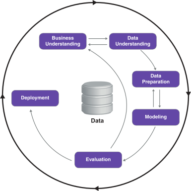
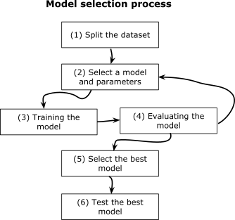

# CRISP-DM - Cross-Industry Standard Process for Data Mining

According to CRISP-DM, the Machine Learning process has 6 steps:
1. Business Understanding
    * Identify the problem
    * Understand how we can solve the problem
    * Decide whether Machine Learning will be a useful tool for solving the problem
2. Data Understanding
    * Analyze available datasets
    * Decide whether we need to collect more data
3. Data Preparation
    * Transform the data into tabular form so that it can be used as input to Machine Learning models
4. Modeling
    * Train the model
5. Evaluation
    * Evaluate the model to see if it solves the original business problem and measure its success at doing that.
6. Deployment
    * Deploy the model to the production environment and battle-test it.

CRISP-DM is an **iterative** process.

Testing a model on a live system is called **online testing**, and it's very important for evaluating the quality of a model on real data. This approach, however, belongs to the evaluation and deployment steps of the process, not to the modeling step.

A better approach for selecting the best model before deploying it is **emulating the scenario of going live**. We get our complete dataset and take a part out of it, keep the part away and train the model on the rest of the data. When the training is done, we pretend that the held-out dataset is the new, unseen data, and we use it to measure the performance of our models. This part of data is often called the **validation set**, and the process of keeping part of a dataset away and using it to evaluate performance is called validation.

Problem with this approach:  **multiple-comparisons problem or multiple-tests problem** i.e. The more times we make predictions on the same dataset, the more likely we are to *see good performance by chance*.

To guard against this problem, we use the same idea: we hold out part of the data again. We call this part of data the **test dataset** and use it rarely, **only to test the model that we selected as the best**.

Setting the validation process is the most important step in machine learning. Without it, there's no reliable way to know whether the model we've just trained is good, useless, or even harmful.
